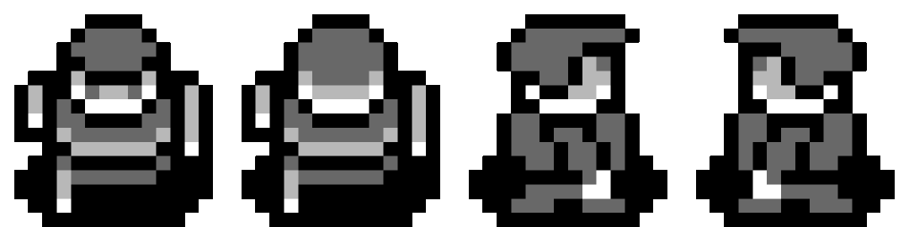

# Zelduh

An "8-bit Zelda" like game. Not an exact clone, but an homage!

## Goals

- [ ] Move to new screen
    - Slide transition
- [ ] State machines
    - [x] State machine for UI
        - [x] Start screen
        - [x] Game screen
        - [x] Pause screen
        - [x] Game over screen
    - [x] State machine for actual game (maybe multiple)
- [ ] Player character movement
    - [x] Move with arrow keys
    - [x] Pressing and holding keys for continuous movement
    - [x] Edge of window boundaries
    - [x] Get rid of delay on win.Repeated()
- [x] NPC movement
- [ ] Projectiles
    - [ ] Player sword is a projectile that shoots one tile 
    - [ ] Enemies can shoot projectiles that go x tiles
- [ ] Animated sprites
    - [ ] Pixel art
    - [ ] Sprite sheet
- [ ] Collision detection
    - [x] Basic implementation
    - [ ] Enemies cause damage
    - [ ] Obstacles
    - [ ] Block projectiles with shield
    - [ ] Pickup items
- [ ] Interact with environment
    - [ ] Open things
    - [ ] Push things
- [ ] Basic stats
    - [ ] Health
    - [ ] Charge sword
- [ ] Attack
    - [ ] Basic sword slash
    - [ ] Charged magic sword projectile
